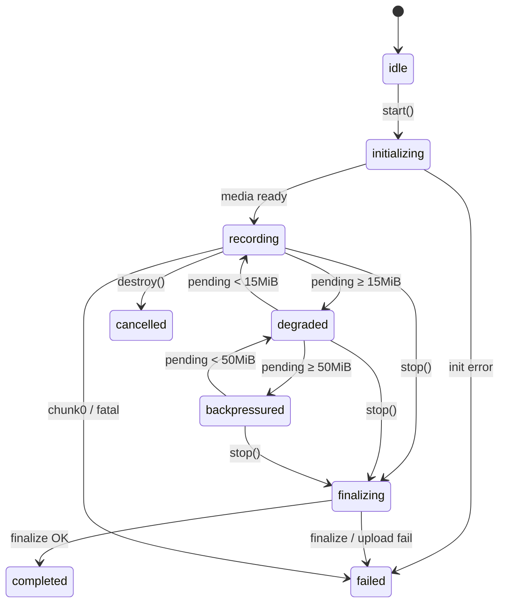

# API Reference

Public surface of **`mediastream-upload`**. All types and the `ChunkRecorder` class are exported from the package root. Adapters are separate entry points.

See also [TESTING.md](./TESTING.md) for what automated tests cover vs browser-only behavior.

---

## Install

```bash
pnpm add mediastream-upload
```

```ts
import {
  ChunkRecorder,
  UnsupportedBrowserError,
  SourceInitializationError,
  // …
} from "mediastream-upload";
```

---

## `ChunkRecorder`

Headless orchestrator: composites sources, records WebM, uploads via a `ChunkRecorderBackend`.

### Constructor

```ts
new ChunkRecorder(options?: ChunkRecorderOptions)
```

### Methods

| Method | Description |
|--------|-------------|
| `start(args: ChunkRecorderStartArgs): Promise<void>` | Init backend, media, recorder; enter `recording` |
| `stop(): Promise<ChunkRecorderStopResult>` | Flush, seek-patch, finalize; enter `completed` |
| `destroy(): void` | Tear down without waiting for finalize; abort if needed |
| `getState(): ChunkRecorderState` | Current state |
| `getEmergencyBlob(): Blob \| null` | Local composited bytes after mid-session failure |

### Example

```ts
const recorder = new ChunkRecorder({
  onStateChange: (state) => console.log(state),
  debug: true,
});

await recorder.start({
  sources: { main: cameraStream, pip: screenStream },
  backend: createR2Backend("https://uploads.example.com"),
});

const { videoUrl, localBlob } = await recorder.stop();
```

---

## Options & Start Args

### `ChunkRecorderOptions`

| Field | Type | Default | Description |
|-------|------|---------|-------------|
| `onStateChange` | `(state: ChunkRecorderState) => void` | — | Fired on every state transition |
| `debug` | `boolean \| LogHandler` | silent | See Logging |

```ts
type LogHandler = (
  level: "info" | "warn" | "error",
  context: string,
  data?: unknown,
) => void;
```

### `ChunkRecorderStartArgs`

| Field | Type | Required | Description |
|-------|------|----------|-------------|
| `sources` | `ChunkRecorderSources` | Yes | `main` + optional `pip` |
| `backend` | `ChunkRecorderBackend` | Yes | Upload contract |
| `metadata` | `Record<string, unknown>` | No | Passed to `backend.init` (e.g. `contentType`) |
| `playbackToSpeakers` | `boolean` | No | Route main audio to speakers |
| `canvasWidth` | `number` | No | Default `1280` |
| `canvasHeight` | `number` | No | Default `720` |
| `fps` | `number` | No | Default `30` |
| `pipWidth` | `number` | No | Default `320` |
| `pipHeight` | `number` | No | Default `180` |
| `pipMargin` | `number` | No | Default `12` (inset from chosen corner) |
| `pipPosition` | `PipPosition` | No | Default `"top-left"` — `"top-right"` \| `"bottom-left"` \| `"bottom-right"` |
| `videoBitsPerSecond` | `number` | No | Default `2_500_000` |
| `audioBitsPerSecond` | `number` | No | Default `128_000` |

```ts
type PipPosition =
  | "top-left"
  | "top-right"
  | "bottom-left"
  | "bottom-right";
```

### `ChunkRecorderSources`

```ts
type ChunkRecorderSource = MediaStream | HTMLVideoElement;

type ChunkRecorderSources = {
  main: ChunkRecorderSource;
  pip?: ChunkRecorderSource;
};
```

Canonical input is `MediaStream`. `HTMLVideoElement` is resolved via `srcObject` (or `captureStream` where available). Plain URL/file without a stream → `SourceInitializationError`.

### `ChunkRecorderStopResult`

```ts
type ChunkRecorderStopResult = {
  videoUrl: string;
  localBlob: Blob | null;
};
```

`localBlob` is seek-repaired when possible (zero third-party deps).

---

## Backend Interface

```ts
type ChunkRecorderBackend = {
  init: (
    metadata: Record<string, unknown>,
  ) => Promise<{ uploadId: string }>;

  sendChunk: (
    uploadId: string,
    sequenceNumber: number,
    checksum: string,
    bytes: Blob,
    options?: { replace?: boolean },
  ) => Promise<void>;

  finalize: (
    uploadId: string,
    totalChunks: number,
    options?: { abrupt?: boolean },
  ) => Promise<{
    videoUrl: string;
    abrupt?: boolean;
    seekRepairStatus?:
      | "none"
      | "pending"
      | "done"
      | "failed"
      | "skipped";
  }>;

  abort: (uploadId: string, reason: string) => Promise<void>;
};
```

See [backend-contract.md](./backend-contract.md).

---

## State Machine

```ts
type ChunkRecorderState =
  | "idle"
  | "initializing"
  | "recording"
  | "degraded"
  | "backpressured"
  | "finalizing"
  | "completed"
  | "failed"
  | "cancelled";
```



---

## Typed Errors (`src/errors.ts`)

All extend `ChunkRecorderError` (itself extends `Error`). Prefer `instanceof` over message parsing.

| Class | When |
|-------|------|
| `ChunkRecorderError` | Base |
| `UnsupportedBrowserError` | Missing WebM `MediaRecorder` / `captureStream` |
| `SourceInitializationError` | Invalid source / no audio tracks / cannot resolve stream |
| `Chunk0FatalError` | Sequence 0 exhausted retries |
| `BackpressureOverflowError` | Optional signal around hard buffer cap (state still primary) |
| `FinalizeError` | Finalize failed after chunks uploaded |

```ts
try {
  await recorder.start({ sources, backend });
} catch (err) {
  if (err instanceof UnsupportedBrowserError) {
    // legacy single-blob path
  } else if (err instanceof SourceInitializationError) {
    // permissions / device UI
  }
}
```

---

## Adapters

```ts
import { createR2Backend } from "mediastream-upload/adapters/r2";
import { createS3Backend } from "mediastream-upload/adapters/s3";

const backend = createR2Backend("https://worker.example.com");
// or
const backend = createS3Backend("https://api.example.com");
```

Both wrap the same HTTP wire protocol (`adapters/http-base.ts`). Swap without changing core recorder code.

---

## Constants (frozen behavior)

| Constant | Value |
|----------|-------|
| Non-final part size | 5 MiB |
| Batch timer | 15 s (non-forcing) |
| Degraded threshold | 15 MiB pending |
| Backpressure cap | 50 MiB pending |
| Max chunk attempts | 3 |
| Backoff cap | ~10 s |
